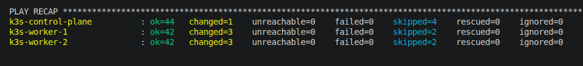

# Ansible

Ansible configures every server after Terraform has finished provisioning the infrastructure.
The configuration is fully automated and idempotent.

## Configuration

The playbook performs the following tasks:

- Install required packages
- Configure administrator user
- Configure SSH authentication
- Harden SSH
- Configure UFW Firewall
- Install k3s
- Join worker nodes
- Configure kubeconfig

## Roles

| Role | Purpose |
|------|---------|
| common | System updates and packages |
| users | Administrator user |
| ssh_hardening | Secure SSH configuration |
| firewall | UFW configuration |
| k3s_server | Install Control Plane |
| k3s_agent | Join Worker Nodes |

All roles are designed to be reusable and modular.

## Playbook Run

The following output shows a successful, idempotent run across all three hosts — no failures, no unreachable nodes.

