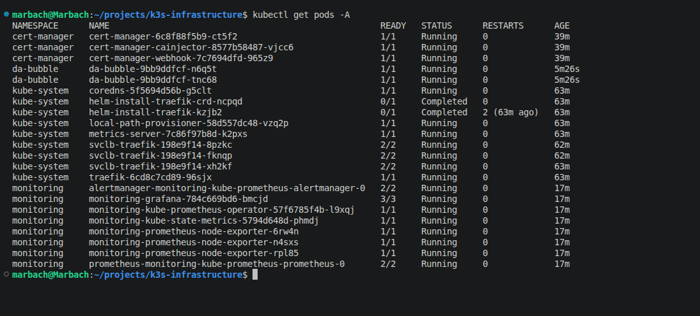

# Deployment

The deployment process is fully automated.

## Workflow

```text
Terraform
      │
      ▼
Provision Infrastructure
      │
      ▼
Ansible
      │
      ▼
Configure Linux Servers
      │
      ▼
Install k3s
      │
      ▼
Deploy Kubernetes Resources
      │
      ▼
Install Monitoring
      │
      ▼
Ready Cluster
```

## Deployment Steps

```bash
terraform apply
ansible-playbook playbook.yml
kubectl apply -f kubernetes/
helm install monitoring ...
```

After deployment the cluster is ready to host applications and expose them securely through Traefik.

