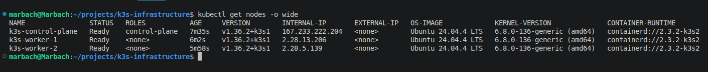
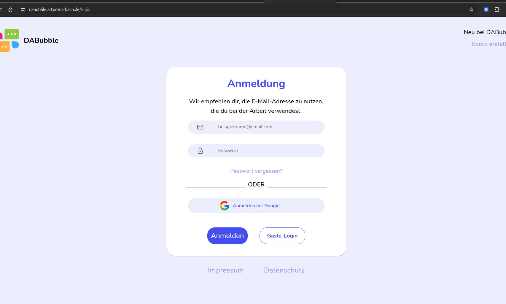
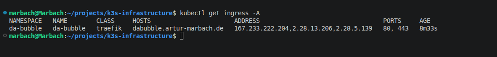

# Kubernetes

The infrastructure is deployed on a lightweight multi-node Kubernetes (k3s) cluster.

## Cluster Topology

The cluster consists of:

- 1 Control Plane
- 2 Worker Nodes

The control plane manages the cluster, while workloads are scheduled across the worker nodes.



## Platform Components

The following platform components are deployed:

- Traefik Ingress Controller
- CoreDNS
- cert-manager
- Let's Encrypt
- Prometheus
- Grafana


## Deployed Applications

The cluster currently hosts the following applications:

- DaBubble

The application is exposed through Traefik using HTTPS certificates issued by Let's Encrypt.



## Networking

Traffic is routed through the cluster using the following architecture:

```text
Internet
    │
    ▼
Traefik Ingress
    │
    ▼
Ingress
    │
    ▼
ClusterIP Service
    │
    ▼
Application Pods
```



This architecture enables multiple applications to share a single public IP address while remaining isolated within the Kubernetes cluster.