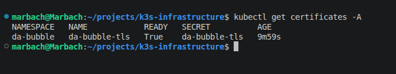

# Security

The infrastructure follows common Linux and Kubernetes security practices.

## Implemented Security Measures

- SSH Key Authentication
- Disabled Root Login
- Disabled Password Authentication
- UFW Firewall
- Automatic HTTPS
- Let's Encrypt TLS Certificates

## HTTPS

TLS certificates are automatically requested and renewed using cert-manager and Let's Encrypt.
Applications are accessible only through encrypted HTTPS connections.

