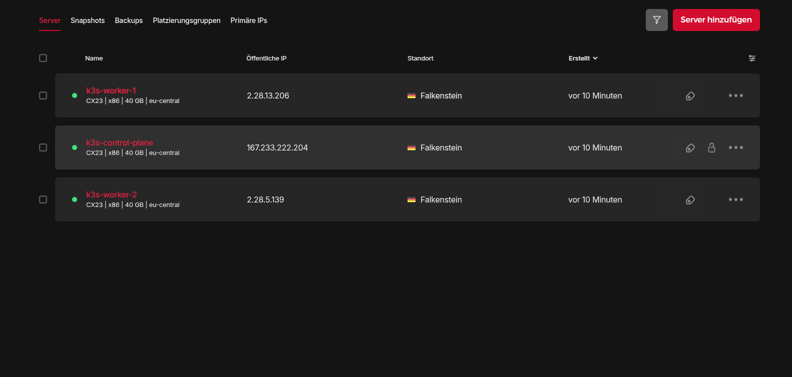

# Terraform

Terraform is used to provision the complete Kubernetes infrastructure on Hetzner Cloud.

The infrastructure consists of one Kubernetes control plane and two worker nodes running Ubuntu Server 24.04.

## Provisioned Resources

- 1 Kubernetes Control Plane
- 2 Kubernetes Worker Nodes
- Ubuntu Server 24.04
- SSH Key Authentication
- Public Networking
- Terraform Outputs

## Infrastructure Layout

| Resource | Description |
|----------|-------------|
| Control Plane | Hosts the Kubernetes API Server |
| Worker Nodes | Run application workloads |
| SSH Keys | Secure server access |

### Infrastructure Overview

The following screenshot shows the provisioned infrastructure running on Hetzner Cloud.



## Features

- Infrastructure as Code
- Parameterized configuration
- Terraform outputs
- Reproducible deployments

## Files

```text
terraform/

main.tf          # Infrastructure resources
variables.tf     # Input variables
outputs.tf       # Terraform outputs
provider.tf      # Hetzner provider
versions.tf      # Terraform version constraints
```

Terraform provisions the infrastructure, while Ansible configures the operating system, installs k3s, and bootstraps the Kubernetes cluster.